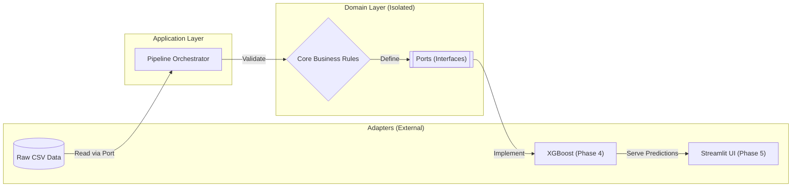

# Supply Chain Optimization ML


This project analyzes 180,000+ e-commerce orders from the [DataCo Smart Supply Chain](https://www.kaggle.com/datasets/shashwatwork/dataco-smart-supply-chain-for-big-data-analysis) dataset to build a machine learning system that predicts late delivery risk in real time.

## Why I Built This

Supply chain data science roles at companies like Amazon, Walmart, and Costco are not just about building models. They require understanding the operational consequences of a wrong prediction and being able to explain a model decision to a non-technical stakeholder. I built this project to practice both.

The initial data analysis surfaced something unexpected: over half of all orders in this dataset arrive late (54.83%), and the problem is almost entirely tied to shipping mode. First Class shipping fails 95.3% of the time. That is a systemic failure, not a random variance issue. That finding made forecasting demand less interesting than predicting exactly which orders are at risk before they leave the warehouse.

## Business Questions

1. **Which orders are likely to arrive late, and what is driving the risk?**  
   I wanted to build a model that answers this question at the moment of order placement, using only information a logistics team would actually have at that point.

2. **Which departments and products should be stocked first?**  
   Fan Shop drives the most volume (around 66,000 orders), but Apparel has the higher profit margin at 12.2%. That distinction matters for inventory prioritization.

3. **How stable is demand across months, and what seasonal patterns exist?**  
   Monthly order trend analysis establishes the baseline for any future forecasting work.

4. **Are there natural clusters of orders that share similar risk profiles, even without labels?**  
   K-Means clustering on order features will surface hidden groupings that supervised models might not expose on their own. For example, a cluster of orders might share a combination of shipping mode, region, and order value that makes them systematically high risk, even if no single factor is dominant.

## What This Project Will Uncover

This project operates on two levels simultaneously.

The first is predictive: given a new order placed right now, how likely is it to arrive late? The XGBoost classifier answers that question using features available at the moment of order placement. SHAP values then explain the prediction in plain terms, showing which factors pushed the risk score up or down for that specific order.

The second is diagnostic: what structural patterns in this logistics network explain why the late delivery rate is so high? The chi-squared test will validate whether the relationship between shipping mode and late delivery is statistically significant or just a sampling artifact. The K-Means clustering will surface natural groupings of orders that share risk profiles, potentially revealing operational problems that no labeled analysis could find.

Together, the supervised and unsupervised threads of this project are designed to answer both individual order questions and systemic network questions.

## Technical Approach

The codebase uses Hexagonal Architecture, which means the core prediction logic in `domain/` has no dependency on the data source, the UI, or the ML framework. I can swap the CSV reader for a live database, or replace XGBoost with a different model, without touching the business logic.



The project uses both supervised and unsupervised machine learning:

- **Supervised (classification):** XGBoost and Logistic Regression predicting `Late_delivery_risk` (0 or 1) from pre-shipment features only. Logistic Regression is the interpretable baseline. XGBoost is the primary production model.
- **Unsupervised (clustering):** K-Means on order features to find natural risk clusters. This surfaces patterns that labeled analysis misses, and adds a segmentation layer to the inventory optimization thread.
- **Statistical validation:** A chi-squared test confirms that the relationship between shipping mode and late delivery is statistically significant, not just a large-sample coincidence.

Before writing any model code, I ran a leakage audit. Two features had to be excluded entirely: `Days for shipping (real)` and `Delivery Status`. Both encode the outcome and would make a model look accurate during training while being completely useless in production. The only shipping-time feature kept was the scheduled days, which is known at order placement.

The test suite uses both standard unit tests and property-based tests via Hypothesis. Property-based testing checks that model invariants hold for any valid input, not just the examples I thought to write manually. All 44 tests pass.

## Technology Stack

| Category | Tools |
|---|---|
| Language | Python 3.12 |
| ML Modeling | XGBoost, Scikit-Learn |
| Experiment Tracking | MLflow |
| Testing | Pytest, Hypothesis |
| Data | Pandas, NumPy |
| Code Quality | Black, Ruff, isort, Mypy |
| Architecture | Hexagonal (Ports and Adapters) |
| CI | GitHub Actions |

## Developer Tooling

I used a few tools throughout development to keep things moving efficiently. Kiro helped with writing out requirements and acceptance criteria before any code was written, which kept the architecture from changing scope mid-project. Cursor served as an IDE with context-aware autocomplete, which was useful when wiring together ports, adapters, and domain services across multiple files at once. I also ran an automated EDA pipeline for the data interrogation work, and used an AI pair reviewer during TDD iterations specifically to trace down failing property tests.

## How to Reproduce

This project uses a `conda` environment. The steps below should get you from a fresh clone to a working test run.

### 1. Clone the repo
```bash
git clone git@github.com:tirthjoship/supply-chain-optimization-ml.git
cd supply-chain-optimization-ml
```

### 2. Create the environment
```bash
conda env create -f environment.yml
conda activate supply-chain-ml
```

### 3. Install pre-commit hooks
```bash
pre-commit install
```

### 4. Download the dataset
The CSV file is around 91MB and is excluded from Git. You can pull it using the Kaggle API:
```bash
kaggle datasets download -d shashwatwork/dataco-smart-supply-chain-for-big-data-analysis -p "data/raw" --unzip
```

### 5. Run the tests
```bash
pytest -v
```
All 44 tests should pass. If any fail, do not proceed to model training until they are resolved.

## Project Structure

```
supply-chain-optimization-ml/
├── domain/            # Core business logic, no framework dependencies
├── adapters/          # CSV reader, ML model adapter, visualization layer
├── application/       # Connects domain to adapters
├── tests/             # Unit tests and property-based tests
├── notebooks/         # EDA notebooks
├── data/              # Not tracked in Git (raw, interim, processed)
├── environment.yml    # Conda spec
└── pyproject.toml     # Black, Ruff, Mypy settings
```

## Project Status

- Phase 0: Governance and toolchain setup (complete)
- Phase 1: Hexagonal architecture scaffold (complete)
- Phase 2: EDA, risk baseline, class imbalance audit, ABC analysis (complete)
- Phase 3: Domain implementation and 44 passing tests (complete)
- Phase 4: Predictive Modeling and Explainability (XGBoost, MLflow, SHAP)
- Phase 5: Streamlit Dashboard deployed to cloud (AWS or Azure, depending on cost)

## Future Work

Once the core model and dashboard are complete, the following infrastructure improvements are planned:

-   **Cloud Deployment (AWS or Azure):** The Streamlit dashboard will be deployed to either AWS EC2 or Azure App Service, depending on which offers the better free tier at the time of deployment. Model artifacts will be stored in S3 or Azure Blob Storage so the trained model is fully reproducible without the local environment.
-   **Continuous Integration and Delivery:** GitHub Actions CI is already running on this repository. The next step is extending it with a CD pipeline that redeploys the app on every merge to main.
-   **Model Registry (MLflow):** All experiment runs are logged with MLflow. The final step is registering the production model version so future contributors can reproduce or improve on it.

## Author

**Tirth Joshi**
Master of Data Science, University of British Columbia
[github.com/tirthjoship](https://github.com/tirthjoship)

## License

MIT. See [LICENSE](LICENSE) for details.
