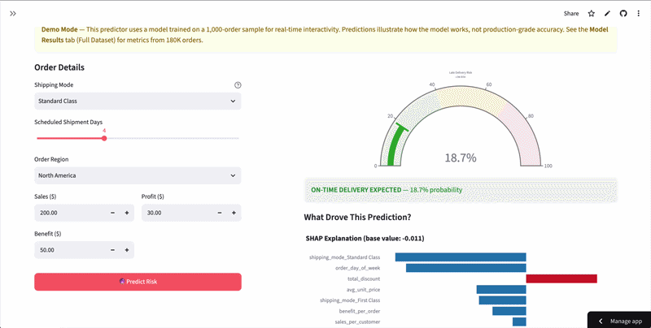
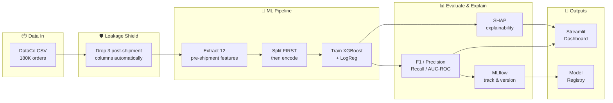

<!-- Banner placeholder — replace with your custom banner image -->
<!-- <p align="center">
  
</p> -->

<h1 align="center">Supply Chain Late Delivery Risk Prediction</h1>

<p align="center">
  <strong>Predict which orders will arrive late — before they ship.</strong>
</p>

<p align="center">
  <a href="#quick-start">Quick Start</a> &bull;
  <a href="#dashboard">Dashboard</a> &bull;
  <a href="#model-comparison">Results</a> &bull;
  <a href="#so-what--the-business-read">Business</a> &bull;
  <a href="#how-it-works">Architecture</a> &bull;
  <a href="#explainability">Explainability</a> &bull;
  <a href="docs/ARCHITECTURE.md">Design Decisions</a>
</p>

<p align="center">
  
  
  
  
  
  
  
  
</p>

<p align="center">
  <a href="https://supply-chain-optimization-ml.streamlit.app/">
    
  </a>
</p>

<!-- Demo GIFs — uncomment after recording
<p align="center">
  
</p>
-->

---

Late delivery risk prediction for e-commerce orders using hexagonal architecture, XGBoost with SHAP explainability, and MLflow experiment tracking.

## Business Problem

**54.83% of orders in the DataCo supply chain dataset are delivered late.** This project predicts which orders will arrive late before shipment, enabling proactive intervention (rerouting, priority handling, customer notification).

Key findings from EDA:
- **First Class** shipping: 95.3% late rate
- **Second Class** shipping: 76.6% late rate
- **Standard Class** shipping: 38.0% late rate
- Shipping mode is the strongest predictor of late delivery risk

## Model Comparison

| Model | F1 | Precision | Recall | AUC-ROC |
|-------|-----|-----------|--------|---------|
| Logistic Regression (baseline) | 0.6531 | 0.8515 | 0.5297 | 0.7241 |
| XGBoost (default, depth=6) | **0.6543** | 0.8448 | **0.5338** | 0.7233 |
| XGBoost (shallow, depth=3) | 0.6532 | 0.8508 | 0.5301 | **0.7253** |
| XGBoost (deep, depth=8) | 0.6543 | 0.8452 | 0.5337 | 0.7244 |

**Primary metric:** F1 score (accuracy is misleading with 55/45 class split)

## So What? — The Business Read

**The honest finding: XGBoost adds no meaningful lift over logistic regression** (F1 0.6648 vs 0.6531 on the temporal split). After leakage removal, late delivery is near-deterministic from **shipping mode** alone (First Class 95.3% late, Second Class 76.7%), and SHAP confirms the model simply re-learns that lookup table. Customer-history features added *zero* lift.

That is a **valid business conclusion, not a failed project.** The defensible production design is a **shipping-mode rule** for the high-risk tiers plus a model only on the ambiguous **Standard Class** tier where lateness is genuinely uncertain.

- 📉 **[Limitations & Decisions](docs/LIMITATIONS_AND_DECISIONS.md)** — why the rule beats the model, calibration (Brier 0.2028 → isotonic), and the cost-driven threshold (0.35, FN ≈ 3× FP).
- 💵 **[Business Impact (illustrative)](docs/BUSINESS_IMPACT.md)** — transparent net-value formula with labeled assumptions and a break-even of `C_late × r ≈ $3.87`. No invented ROI.
- 📊 **[Frozen metrics](reports/model_comparison.json)** — every number above traces to a saved run.

> *Interview line:* "I shipped a leakage-safe classifier with full MLOps scaffolding, then used SHAP to show a 4-row rule already captures most of the signal — so I recommended the simpler tool. The deliverable was the decision, not the model."

## Explainability

SHAP (SHapley Additive exPlanations) provides both global and local explanations:
- **Global:** Which features drive late delivery risk across all orders
- **Local:** Why a specific order was flagged as high-risk

Top features by mean |SHAP value| (XGBoost default):
1. `shipping_mode_Standard Class` — 0.6160
2. `shipping_mode_First Class` — 0.4318
3. `shipping_mode_Second Class` — 0.1344
4. `shipping_mode_Same Day` — 0.0748
5. `sales_per_customer` — 0.0541

## Experiment Tracking

All training runs are logged to MLflow with:
- Model hyperparameters (prefixed `hp_`)
- Evaluation metrics (F1, precision, recall, AUC-ROC)
- Trained model artifacts + fitted encoder
- SHAP explanations
- Model Registry for production deployment

## How It Works



**Architecture:** Hexagonal (ports & adapters) — business rules in `domain/` have zero external imports. ML frameworks, data sources, and UI are swappable adapters.

**Why this matters:** Swap XGBoost for LightGBM? Write one adapter file. Data from a database instead of CSV? One adapter. Domain logic and tests don't change.

## Repository Structure

```
supply-chain-optimization-ml/
│
├── 🧠 domain/                       # Business rules (zero external imports)
│   ├── models.py                    # Order, Product, MetricsResult, RiskCohort
│   ├── ports.py                     # Interfaces adapters must implement
│   ├── services.py                  # Feature extraction, risk classification
│   └── exceptions.py               # Domain-specific errors
│
├── 🔌 adapters/                     # External tool integrations
│   ├── data/csv_repository.py       # CSV reader + leakage column shield
│   ├── ml/feature_encoder.py        # OneHot + StandardScaler encoding
│   ├── ml/sklearn_predictor.py      # LogReg + XGBoost model wrappers
│   ├── ml/evaluation.py             # F1, precision, recall, AUC-ROC
│   ├── ml/shap_explainer.py         # SHAP TreeExplainer + LinearExplainer
│   ├── ml/mlflow_tracker.py         # MLflow logging + Model Registry
│   ├── ml/kmeans_clusterer.py       # K-Means clustering + silhouette
│   └── visualization/plotly_charts.py  # 8 interactive Plotly charts
│
├── 🎯 application/                  # Orchestration layer
│   └── use_cases.py                 # Train, Predict, Cluster, Profile
│
├── 📱 app/                          # Streamlit dashboard (4 tabs)
│   ├── streamlit_app.py             # Entry point + sidebar toggle
│   └── components/                  # Tab implementations
│
├── 🧪 tests/                        # 156 tests, 93% coverage
│   ├── test_domain_*.py             # Domain model + service tests
│   ├── test_ml/                     # Adapter contract tests
│   ├── test_properties.py           # Hypothesis property-based tests
│   └── test_visualization/          # Chart output tests
│
├── 📓 notebooks/                    # EDA + training narrative
├── 📜 scripts/train.py              # CLI training entry point
├── 📊 data/                         # Raw (gitignored) + sample (committed)
└── ⚙️ .github/workflows/            # CI: lint, test, typecheck, security
```

## Data Leakage Protection

Three columns are **never** used as features (enforced by `LEAKAGE_COLUMNS` in `csv_repository.py`):

| Column | Why It Leaks |
|--------|-------------|
| `Days for shipping (real)` | Only known after delivery — reveals the outcome |
| `Delivery Status` | Directly encodes late/on-time — IS the outcome |
| `shipping date (DateOrders)` | Future information unavailable at prediction time |

The encoder is **fit on training data only** (split-before-encode pattern) to prevent preprocessing leakage.

## Quick Start

```bash
# 1. Clone and setup
git clone https://github.com/tirthjoship/supply-chain-optimization-ml.git
cd supply-chain-optimization-ml
make setup

# 2. Quick demo (sample data, included in repo)
python scripts/train.py --sample

# 3. Full training (download DataCo from Kaggle first)
#    https://www.kaggle.com/datasets/shashwatwork/dataco-smart-supply-chain-for-big-data-analysis
#    Place CSV in data/raw/DataCoSupplyChainDataset.csv
python scripts/train.py

# 4. View experiment dashboard
mlflow ui --backend-store-uri sqlite:///mlflow.db
# Open http://localhost:5000

# 5. Run tests
make check   # lint + typecheck + test with 90% coverage gate
make test     # tests only
```

## Dashboard

Interactive Streamlit dashboard with 4 tabs:

```bash
make app
# Opens at http://localhost:8501
```

- **🔮 Risk Predictor** — Enter order details, get live risk score + SHAP waterfall
- **📊 Model Results** — Side-by-side LogReg vs XGBoost metrics + SHAP importance
- **🎯 Customer Segments** — K-Means cluster profiles + PCA scatter
- **📋 Data Explorer** — Key statistics + shipping mode + region distributions

Sidebar toggle switches between **Full Dataset (180K)** and **Sample (1K)** statistics. Risk Predictor uses sample-trained model for live interactivity.

## Quality

- **156 tests** at 93% coverage (90% gate enforced in CI)
- **mypy strict** — full type safety across domain, adapters, application
- **Pre-commit hooks** — black, isort, ruff, mypy, gitleaks
- **Property-based testing** — Hypothesis for domain invariants
- **CI/CD** — GitHub Actions: test suite, linting, mypy strict, secret scanning

## Tech Stack

| Layer | Technologies |
|-------|-------------|
| ML Models | XGBoost, scikit-learn (Logistic Regression) |
| Explainability | SHAP (TreeExplainer, LinearExplainer) |
| Experiment Tracking | MLflow (SQLite backend, Model Registry) |
| Data | pandas, DataCo Supply Chain (180k orders) |
| Testing | pytest, Hypothesis, pytest-cov |
| Quality | mypy strict, black, isort, ruff, gitleaks |
| CI/CD | GitHub Actions (3 workflows) |

## Dataset

[DataCo SMART Supply Chain](https://www.kaggle.com/datasets/shashwatwork/dataco-smart-supply-chain-for-big-data-analysis) — 180,519 orders across multiple product categories, shipping modes, and customer segments.

## License

MIT
