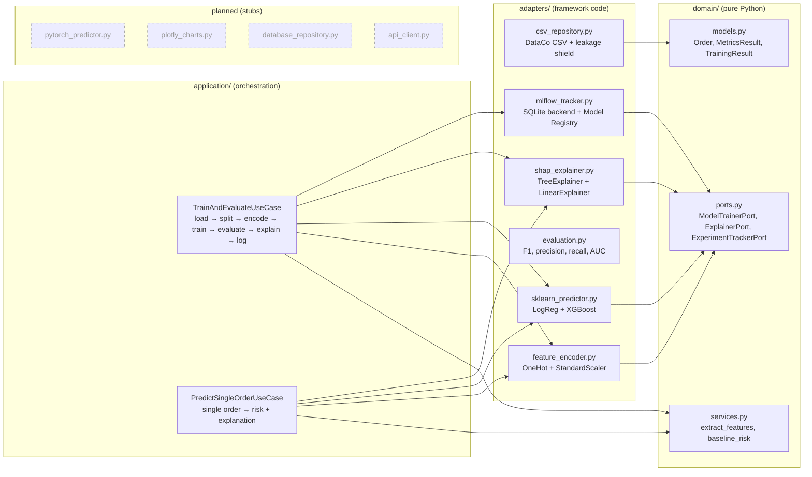

# Supply Chain Optimization ML

Late delivery risk prediction for e-commerce orders using hexagonal architecture, XGBoost with SHAP explainability, and MLflow experiment tracking.

## Business Problem

**54.83% of orders in the DataCo supply chain dataset are delivered late.** This project predicts which orders will arrive late before shipment, enabling proactive intervention (rerouting, priority handling, customer notification).

Key findings from EDA:
- **First Class** shipping: 95.3% late rate
- **Second Class** shipping: 76.6% late rate
- **Standard Class** shipping: 38.0% late rate
- Shipping mode is the strongest predictor of late delivery risk

## Model Comparison

| Model | F1 | Precision | Recall | AUC-ROC |
|-------|-----|-----------|--------|---------|
| Logistic Regression (baseline) | 0.6531 | 0.8515 | 0.5297 | 0.7241 |
| XGBoost (default, depth=6) | **0.6543** | 0.8448 | **0.5338** | 0.7233 |
| XGBoost (shallow, depth=3) | 0.6532 | 0.8508 | 0.5301 | **0.7253** |
| XGBoost (deep, depth=8) | 0.6543 | 0.8452 | 0.5337 | 0.7244 |

**Primary metric:** F1 score (accuracy is misleading with 55/45 class split)

## Explainability

SHAP (SHapley Additive exPlanations) provides both global and local explanations:
- **Global:** Which features drive late delivery risk across all orders
- **Local:** Why a specific order was flagged as high-risk

Top features by mean |SHAP value| (XGBoost default):
1. `shipping_mode_Standard Class` — 0.6160
2. `shipping_mode_First Class` — 0.4318
3. `shipping_mode_Second Class` — 0.1344
4. `shipping_mode_Same Day` — 0.0748
5. `sales_per_customer` — 0.0541

## Experiment Tracking

All training runs are logged to MLflow with:
- Model hyperparameters (prefixed `hp_`)
- Evaluation metrics (F1, precision, recall, AUC-ROC)
- Trained model artifacts + fitted encoder
- SHAP explanations
- Model Registry for production deployment

## Architecture

Hexagonal (ports & adapters) — domain logic is pure Python with zero framework imports.



## Repository Structure

```
supply-chain-optimization-ml/
├── domain/                          # Pure business logic (zero external imports)
│   ├── models.py                    # Order, MetricsResult, TrainingResult, PredictionResult
│   ├── ports.py                     # Protocol interfaces for all adapters
│   ├── services.py                  # extract_features(), baseline_late_delivery_risk_flag()
│   └── exceptions.py               # Domain-specific errors
│
├── adapters/                        # External framework integrations
│   ├── data/
│   │   ├── csv_repository.py        # DataCo CSV reader with leakage column shield
│   │   ├── database_repository.py   # DB adapter (stub)
│   │   └── api_client.py            # API adapter (stub)
│   └── ml/
│       ├── feature_encoder.py       # ColumnTransformer (OneHot + StandardScaler)
│       ├── sklearn_predictor.py     # LogisticRegression + XGBoost predictors
│       ├── evaluation.py            # compute_metrics() → MetricsResult
│       ├── shap_explainer.py        # SHAP global + local explanations
│       ├── mlflow_tracker.py        # MLflow SQLite backend + Model Registry
│       └── pytorch_predictor.py     # Neural net adapter (stub)
│
├── application/                     # Use case orchestration
│   └── use_cases.py                 # TrainAndEvaluateUseCase, PredictSingleOrderUseCase
│
├── tests/                           # 110+ tests, 90% coverage
│   ├── conftest.py                  # Synthetic order fixtures (never loads real CSV)
│   ├── test_domain_models.py        # Domain model invariants
│   ├── test_domain_services.py      # Feature extraction, baseline risk
│   ├── test_csv_repository.py       # CSV parsing, leakage shield
│   ├── test_properties.py          # Hypothesis property-based tests
│   ├── test_use_cases.py            # End-to-end pipeline tests
│   └── test_ml/                     # ML adapter contract tests
│       ├── test_feature_encoder.py
│       ├── test_sklearn_predictor.py
│       ├── test_evaluation.py
│       ├── test_shap_explainer.py
│       └── test_mlflow_tracker.py
│
├── notebooks/
│   ├── eda_initial.ipynb            # Exploratory data analysis (180k orders)
│   └── train_pipeline.ipynb         # Training narrative (model comparison + SHAP)
│
├── scripts/
│   ├── train.py                     # CLI training entry point
│   └── generate_sample.py           # Generate PII-stripped sample CSV
│
├── data/
│   ├── raw/                         # Full DataCo CSV (gitignored, 95MB)
│   └── sample/
│       └── sample.csv               # 1000-row PII-stripped sample (committed)
│
├── .github/workflows/               # CI: tests, lint, mypy strict, gitleaks
├── .pre-commit-config.yaml          # black, isort, mypy, ruff, gitleaks
├── Makefile                         # make test, lint, typecheck, check
└── pyproject.toml                   # Python 3.12, mypy strict, 90% coverage gate
```

## Data Leakage Protection

Three columns are **never** used as features (enforced by `LEAKAGE_COLUMNS` in `csv_repository.py`):

| Column | Why It Leaks |
|--------|-------------|
| `Days for shipping (real)` | Only known after delivery — reveals the outcome |
| `Delivery Status` | Directly encodes late/on-time — IS the outcome |
| `shipping date (DateOrders)` | Future information unavailable at prediction time |

The encoder is **fit on training data only** (split-before-encode pattern) to prevent preprocessing leakage.

## Quick Start

```bash
# 1. Clone and setup
git clone https://github.com/tirthjoship/supply-chain-optimization-ml.git
cd supply-chain-optimization-ml
make setup

# 2. Quick demo (sample data, included in repo)
python scripts/train.py --sample

# 3. Full training (download DataCo from Kaggle first)
#    https://www.kaggle.com/datasets/shashwatwork/dataco-smart-supply-chain-for-big-data-analysis
#    Place CSV in data/raw/DataCoSupplyChainDataset.csv
python scripts/train.py

# 4. View experiment dashboard
mlflow ui --backend-store-uri sqlite:///mlflow.db
# Open http://localhost:5000

# 5. Run tests
make check   # lint + typecheck + test with 90% coverage gate
make test     # tests only
```

## Dashboard

Interactive Streamlit dashboard with 4 tabs:

```bash
make app
# Opens at http://localhost:8501
```

- **Predict & Explain** — Enter order details, get risk score + SHAP explanation
- **Model Performance** — Side-by-side LogReg vs XGBoost metrics + SHAP importance
- **Risk Cohorts** — K-Means cluster scatter + cohort profile cards
- **Dataset** — Key statistics + shipping mode + region breakdowns

Models train on the 1000-row sample CSV at startup (~3 seconds, cached).

## Quality

- **110+ tests** at 90% coverage (90% gate enforced in CI)
- **mypy strict** — full type safety across domain, adapters, application
- **Pre-commit hooks** — black, isort, ruff, mypy, gitleaks
- **Property-based testing** — Hypothesis for domain invariants
- **CI/CD** — GitHub Actions: test suite, linting, mypy strict, secret scanning

## Tech Stack

| Layer | Technologies |
|-------|-------------|
| ML Models | XGBoost, scikit-learn (Logistic Regression) |
| Explainability | SHAP (TreeExplainer, LinearExplainer) |
| Experiment Tracking | MLflow (SQLite backend, Model Registry) |
| Data | pandas, DataCo Supply Chain (180k orders) |
| Testing | pytest, Hypothesis, pytest-cov |
| Quality | mypy strict, black, isort, ruff, gitleaks |
| CI/CD | GitHub Actions (3 workflows) |

## Dataset

[DataCo SMART Supply Chain](https://www.kaggle.com/datasets/shashwatwork/dataco-smart-supply-chain-for-big-data-analysis) — 180,519 orders across multiple product categories, shipping modes, and customer segments.

## License

MIT
