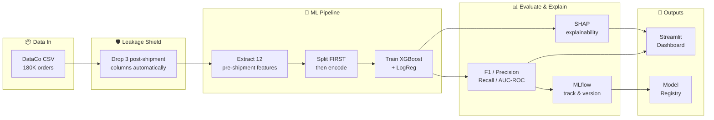
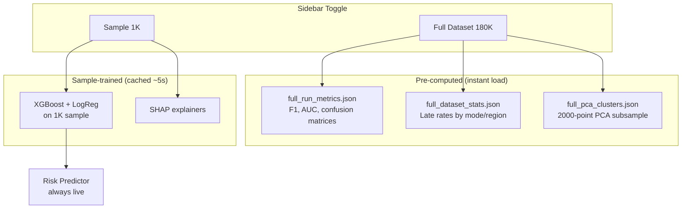

# Architecture & Design Decisions

> How this project works and why every choice was made.

## Data Flow



## Architecture Pattern

**Hexagonal (Ports & Adapters)** — dependencies point inward only.

```
adapters/     →  domain/  ←  application/
(frameworks)     (pure)      (orchestration)
```

- `domain/` imports ONLY Python stdlib. Zero sklearn, pandas, or numpy.
- Adapters implement domain Protocol interfaces.
- Swap XGBoost for LightGBM? One new adapter. Domain unchanged.

## Key Design Decisions

| Decision | Choice | Why | Alternative Considered |
|----------|--------|-----|----------------------|
| Architecture | Hexagonal | Swappable adapters, testable domain | Flat scripts |
| Primary metric | F1 score | 55/45 split makes accuracy misleading | AUC-ROC |
| Explainability | SHAP | Additive, local + global, theoretically grounded | LIME |
| Tracking | MLflow (SQLite) | Industry standard, Model Registry | W&B |
| Encoding | Split-before-encode | Prevents preprocessing leakage | Encode-then-split |
| Clustering | K-Means + silhouette | Interpretable, good for segmentation | DBSCAN |
| Dashboard | Streamlit | Python-native, free hosting | Dash |
| Testing | pytest + Hypothesis | Property-based catches edge cases | unittest |
| Data source toggle | Strategy C hybrid | Full metrics + live sample predictions | All-sample or all-full |
| Temporal split | Default for training | No temporal degradation found; temporal is more realistic evaluation | Random-only |
| Threshold | Ops compromise (0.35) | Pure cost-opt under FN=3×FP is 0.05 (flags all); 0.35 raises recall 0.58→0.80 at flag_rate ≈0.72 | Fixed 0.5 |
| Calibration | Adapter exists, not wired | Brier=0.2028 showed poor calibration; `CalibratedModelAdapter` unit-tested; train/app still use raw probabilities | Always calibrate in serving |
| Feature V2 | Explored, not promoted | Point-in-time customer features showed zero lift; shipping mode dominates | Naive features |
| Error analysis | Notebook exploration | No systematic segment bias found; errors uniformly distributed | Dashboard tab |

## Leakage Protection (3 Layers)

| Layer | What It Does |
|-------|-------------|
| `LEAKAGE_COLUMNS` constant | Physically drops `Days for shipping (real)`, `Delivery Status`, `shipping date` at CSV adapter |
| Split-before-encode | Encoder never sees test data during fit |
| Property-based tests | Hypothesis verifies leakage column names never appear in feature output |

## Dashboard Architecture (Strategy C)



**Risk Predictor** always uses live sample model for interactivity. Stats tabs switch between pre-computed full metrics and live sample metrics via sidebar toggle.
