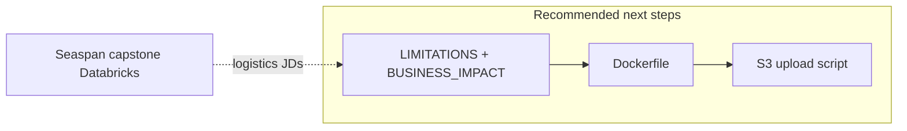

# Supply Chain Project — Improvement Plan

**Repo:** `supply-chain-optimization-ml`
**Status:** Implementation complete; **value narrative needs strengthening**
**Root cause of “weak lift”:** DataCo dataset semantics — after leakage removal, `shipping_mode` ≈ label (First Class 95.3% late). XGBoost F1 ~0.654 vs LogReg ~0.653. This is a **valid conclusion**, not a failed project.

**Portfolio context:** [`../PORTFOLIO_LOCKED_DECISIONS.md`](../PORTFOLIO_LOCKED_DECISIONS.md)

---

## Goal

Transform repo from “ML didn’t beat baseline” to **“production-grade system + honest decision science”** — what Vancouver enterprise and Seattle ML-adjacent roles respect.

---

## P0 — Must ship before job applications

| Task | File / artifact | Acceptance criteria |
|------|-----------------|---------------------|
| Limitations & decisions doc | `docs/LIMITATIONS_AND_DECISIONS.md` | Explains shipping-mode dominance; when rules beat ML; cost of FP/FN |
| Business impact model | `docs/BUSINESS_IMPACT.md` | Formula: `late_orders × avg_cost_per_late`; all assumptions labeled |
| Freeze metrics | `reports/model_comparison.json` | F1, precision, recall, AUC for LogReg + XGBoost variants from actual run |
| README “So what?” section | `README.md` | Links to both docs; recruiter understands in 2 min |
| Remove aspirational claims | README, cv.md | Delete unverified % improvements (e.g. old roadmap “23% reduction”) |

---

## P1 — Strong portfolio polish

| Task | Artifact |
|------|----------|
| 3 local SHAP case studies | `docs/SHAP_CASE_STUDIES.md` or notebook — “why order X flagged” |
| Streamlit demo GIF | `assets/streamlit-demo.gif` (90s) |
| MLflow run ID in README | Pointer to experiment artifact path |
| Calibration note | Brief section: predicted prob vs observed late rate |

---

## P2 — Optional

| Task | Note |
|------|------|
| `CLAUDE.md` + `AGENTS.md` parity | Copy pattern from `patient-readmission-risk-engine` |
| Demand forecasting phase | **Defer** — DataCo weak for time series; don’t expand scope |
| New dataset | **Rejected** — polish narrative instead |

---

## Content outline: `LIMITATIONS_AND_DECISIONS.md`

1. **Dataset:** DataCo is tutorial-grade; 54.83% late rate is suspiciously high.
2. **Feature dominance:** SHAP top features are shipping modes (0.61 / 0.43 / 0.13).
3. **Model comparison:** XGBoost default F1 0.6543 vs LogReg 0.6531 — not worth ops complexity.
4. **Recommendation:** Rule-based flag on First/Second Class + manual review for Standard Class edge cases.
5. **What we still proved:** Leakage shield, split-before-encode, MLflow, hexagonal arch, 156 tests.
6. **Interview talking point:** *“I shipped the pipeline and let the data tell us simple rules were enough.”*

---

## Content outline: `BUSINESS_IMPACT.md`

```text
Assumptions (EDIT with user-approved values):
- Total orders analyzed: 180,519
- Late rate: 54.83%
- Cost per late delivery (customer service + refund + reship): $X (industry range $5–$25 — pick one, cite source or label as illustrative)
- Model at threshold T: precision P, recall R
- Expected interventions per month: N

Scenario A — Rule only (First + Second Class): ...
Scenario B — ML on Standard Class only: ...
```

**Never invent dollar outcomes on resume** — only numbers computed from this doc.

---

## Claude Code — suggested prompt

```text
Read docs/IMPROVEMENT_PLAN.md and supply-chain-optimization-ml/CLAUDE.md.
Do P0 only: write LIMITATIONS_AND_DECISIONS.md and BUSINESS_IMPACT.md from
existing README metrics and SHAP findings. Run training once if needed to
populate reports/model_comparison.json. Update README with So what section.
Do not change domain logic or add features. Do not invent metrics.
```

---

## Future enhancements — platform & portfolio (2026-05-30)

**Reference:** [`../../PORTFOLIO_TOOLS_PLAYBOOK.md`](../../PORTFOLIO_TOOLS_PLAYBOOK.md) · Project 1 architecture diagram

**E2E complete when:** Streamlit + limitations docs + Docker + optional S3. **Do not** add Databricks here — cite **Seaspan capstone** on logistics/risk JDs instead.

### Apply-ready (before heavy infra)

| Priority | Enhancement | Tool | Employer signal |
|----------|-------------|------|-----------------|
| P0 | Limitations + business impact docs | Markdown | ML judgment |
| P0 | `Dockerfile` + `docker-compose.yml` | Docker | Reproducible deploy |
| P1 | `scripts/upload_artifacts.py` | AWS S3 | Cloud artifacts |
| P1 | Upload `reports/model_comparison.json`, SHAP exports | S3 | Audit trail |
| P1 | README architecture mermaid + `docker run` | Docs | 10-min recruiter scan |

### Optional layers (after E2E)

| Enhancement | Tool | Notes |
|-------------|------|-------|
| MLflow → S3 artifact store | AWS S3 + MLflow | Replace local SQLite backend for “production-shaped” demo |
| FastAPI scoring endpoint | FastAPI + Docker | Only if you need API story beyond Streamlit |
| Drift monitoring on **new** live data | Custom + MLflow | **Skip on static DataCo** — performative on fixed CSV |
| Feature store | Feast/Tecton | **Reject** — overkill for 180K static rows |
| Databricks / Snowflake | — | **Reject in this repo** — 180K fits laptop; Seaspan covers Databricks |
| EC2 24/7 hosting | AWS EC2 | **Reject** — Streamlit Cloud already live |

### Interview pairing

| JD type | Lead with |
|---------|-----------|
| Logistics / supply chain / Amazon-adjacent | **Seaspan capstone (Databricks)** + this repo (honest ML + Streamlit) |
| ML engineer | Hexagonal arch + leakage + MLflow + Docker |
| DA / BI | Limitations doc + business impact + dashboard |


