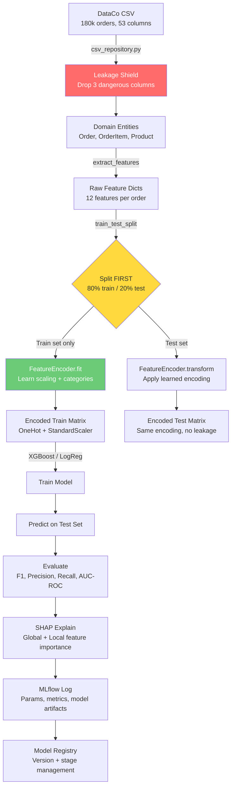
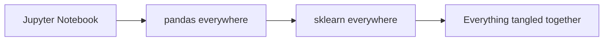
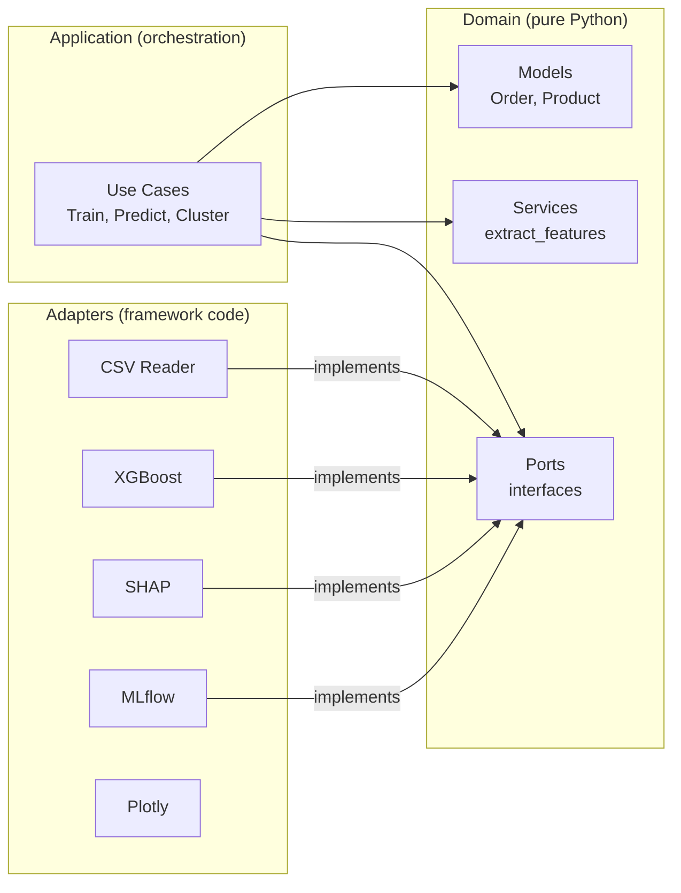
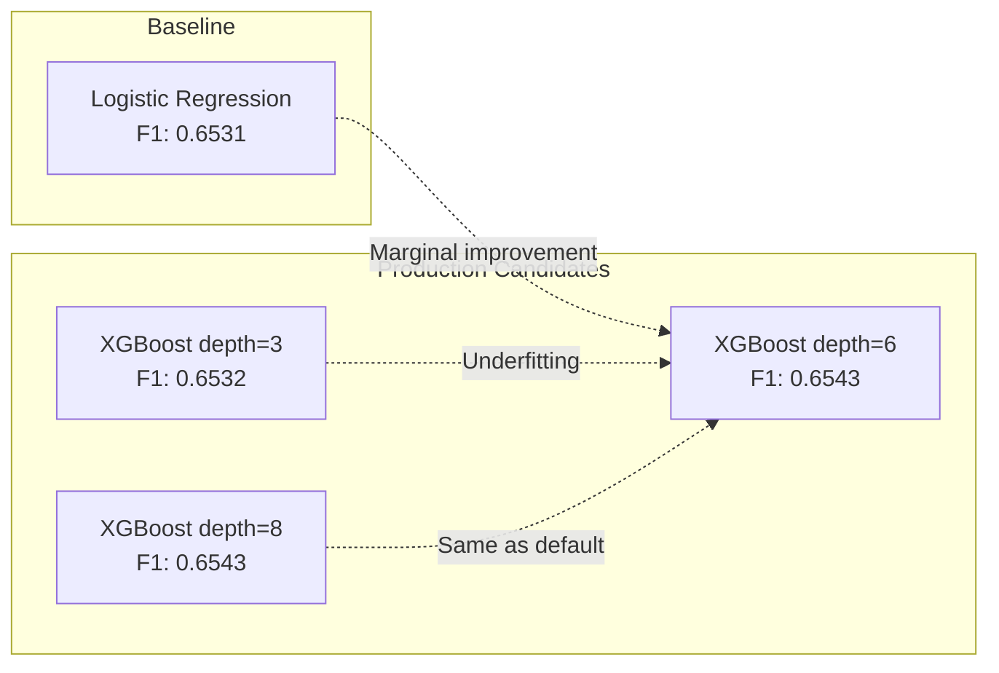
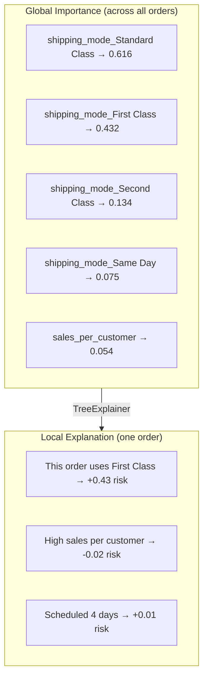
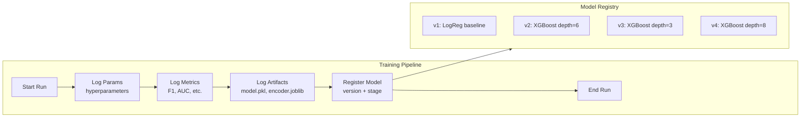
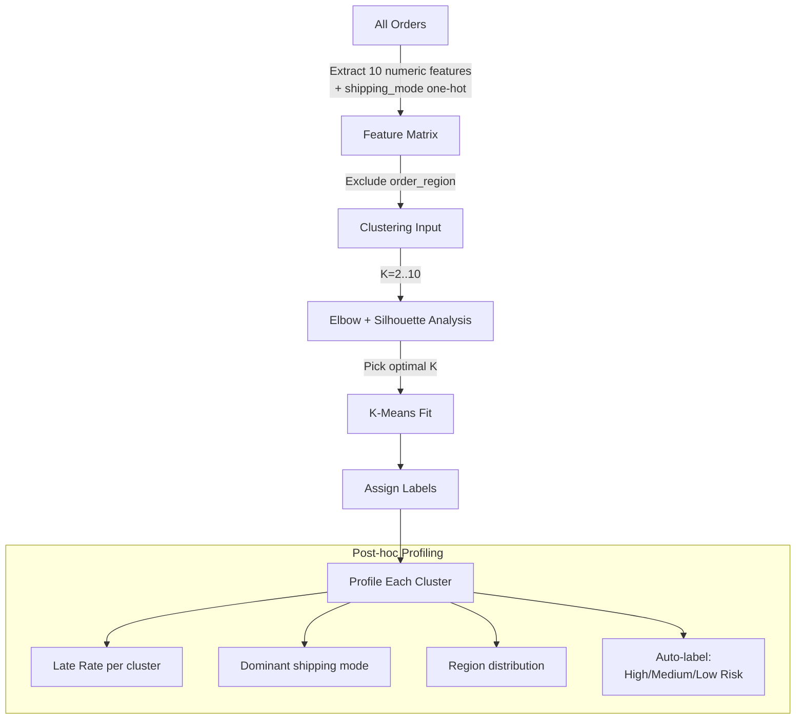
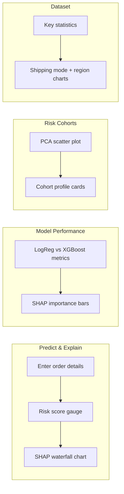
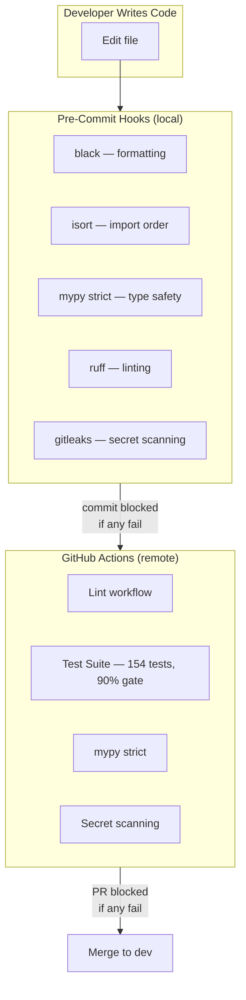

# Project Deep Dive — Supply Chain Late Delivery Risk Prediction

> A plain-English walkthrough of what this project does, why every decision was made, and how data flows from raw CSV to interactive dashboard. Written for interview prep and future-you when your brain isn't working.

---

## The One-Sentence Summary

**We predict which e-commerce orders will arrive late _before_ they ship, so a logistics team can reroute, prioritize, or notify customers proactively.**

---

## The Business Problem

The DataCo supply chain dataset has ~180,000 orders. **54.83% are delivered late.** That's not a small edge case — more than half of all orders miss their delivery window.

The late rates by shipping mode tell the real story:

| Shipping Mode | Late Rate | What This Means |
|---------------|-----------|-----------------|
| First Class | 95.3% | Almost always late — the "premium" option is broken |
| Second Class | 76.6% | Three out of four are late |
| Standard Class | 38.0% | Best performer, but still significant |
| Same Day | Lowest | Works as promised |

**The counterintuitive finding:** "First Class" sounds premium but has the worst late rate. This is the kind of insight that makes a recruiter pause and ask questions — which is exactly what you want.

---

## End-to-End Data Flow

This is how data moves through the entire system, from CSV file to risk prediction:



**The three red-flag steps** (where data leakage can sneak in):
1. **Leakage Shield** — Must drop columns before anything else
2. **Split FIRST** — If you encode before splitting, test data statistics leak into training
3. **Fit on Train ONLY** — Encoder learns means/categories from training data only

---

## Why Hexagonal Architecture?

Most ML projects look like this:



This project looks like this:



**Why this matters in an interview:**

| Question They Ask | Your Answer |
|-------------------|-------------|
| "What if you need to swap XGBoost for LightGBM?" | Write a new adapter. Domain untouched. |
| "What if data comes from a database instead of CSV?" | Write a new adapter. Domain untouched. |
| "How do you prevent data leakage?" | Leakage columns are blocked at the adapter boundary. Domain never sees them. |
| "How do you test without real data?" | Domain is pure Python. Tests use tiny fixtures. No CSV, no sklearn, no network. |

**The rule:** Dependencies point inward. Domain imports nothing external. Adapters implement domain Protocols. Application wires them together.

---

## The 12 Features We Use

These are extracted by `domain/services.py:extract_features()`:

| Feature | Type | Source | Why It's Safe |
|---------|------|--------|---------------|
| `shipping_mode` | Categorical | Order | Known at order time |
| `days_for_shipment_scheduled` | Numeric | Order | Scheduled, not actual |
| `order_month` | Numeric | Order date | When order was placed |
| `order_day_of_week` | Numeric | Order date | Day patterns matter |
| `order_region` | Categorical | Order | Geographic risk factor |
| `benefit_per_order` | Numeric | Order | Profit metrics |
| `sales_per_customer` | Numeric | Customer | Customer value tier |
| `order_profit_per_order` | Numeric | Order | Margin indicator |
| `item_count` | Numeric | Order items | Complexity proxy |
| `total_quantity` | Numeric | Order items | Volume proxy |
| `total_discount` | Numeric | Order items | Discount aggressiveness |
| `avg_unit_price` | Numeric | Order items | Product tier |

### The 3 Features We NEVER Use (Leakage)

| Banned Column | Why It's Dangerous |
|---------------|-------------------|
| `Days for shipping (real)` | Only known AFTER delivery. Using it = telling the model the answer. |
| `Delivery Status` | Literally IS the target variable in different words. |
| `shipping date (DateOrders)` | Future info — we can't know the ship date at order time. |

---

## Model Comparison — What We Tried and Why



**The honest truth about these numbers:**

All models cluster around F1 ~0.65. XGBoost barely beats LogReg. This is not a model problem — **it's a signal problem.** Shipping mode dominates so heavily (95.3% late for First Class) that the model is essentially learning a lookup table.

**Why we use F1 instead of accuracy:**
- Class split is 55/45 (late vs on-time)
- A model that predicts "always late" gets 55% accuracy — sounds decent, is useless
- F1 balances precision (don't cry wolf) and recall (don't miss real late orders)

---

## SHAP Explainability — Why Each Order Is Flagged



**Why SHAP over feature importance:**
- Random Forest `feature_importances_` shows what features are USED but not HOW
- SHAP shows DIRECTION: does Standard Class push risk UP or DOWN?
- SHAP is additive: local explanations sum to the prediction
- Recruiters ask "how do you explain your model?" — SHAP is the gold standard answer

---

## Experiment Tracking with MLflow



**What's logged per run:**
- `hp_*` prefixed hyperparameters (n_estimators, max_depth, learning_rate, etc.)
- Metrics: F1, precision, recall, AUC-ROC
- Artifacts: trained model + fitted encoder (for serving)
- Model Registry entry with version number

**Storage:** Local SQLite (`mlflow.db`) — not a remote server. Good for portfolio, easy to demo.

---

## K-Means Risk Cohorts — Unsupervised Segmentation

Beyond prediction, we cluster orders into risk cohorts to find natural groupings:



**Key design choice:** `order_region` is excluded from clustering INPUT but included in cluster PROFILING. Why? Region adds noise to clustering (too many categories) but is useful for understanding what each cluster looks like.

---

## The Streamlit Dashboard — 4 Tabs



Models train on the 1000-row sample at startup (~3 seconds, cached with `@st.cache_resource`).

---

## Architecture Decision Record

| Decision | Choice | Why | Alternative Considered |
|----------|--------|-----|----------------------|
| Architecture | Hexagonal (ports & adapters) | Swappable adapters, testable domain, interview talking point | Flat scripts, layered MVC |
| Primary metric | F1 score | 55/45 split makes accuracy misleading | AUC-ROC (good but doesn't capture threshold trade-off) |
| Explainability | SHAP | Additive, local + global, theoretically grounded | Feature importance, LIME |
| Experiment tracking | MLflow local (SQLite) | Industry standard, Model Registry, free | Weights & Biases (better UI but adds dependency) |
| Feature encoding | Split-before-encode | Prevents preprocessing leakage | Encode-then-split (common but wrong) |
| Clustering | K-Means with silhouette | Simple, interpretable, good for portfolio | DBSCAN (no K needed but less explainable) |
| Dashboard | Streamlit | Python-native, fast to build, free hosting | Dash (more control but more code) |
| Testing | pytest + Hypothesis | Property-based tests catch edge cases | unittest (verbose, less powerful) |
| Type checking | mypy strict | Catches bugs before runtime, shows rigor | pyright (faster but less standard) |
| Logging | loguru | One-line setup, structured output | stdlib logging (verbose config) |
| Data format | DataCo CSV (Kaggle) | Public, realistic, 180k rows, multi-domain | Synthetic data (less credible) |
| Leakage protection | Constant + adapter shield | Impossible to accidentally use banned columns | Documentation only (humans forget) |

---

## What the Code Structure Maps To

```
supply-chain-optimization-ml/
│
├── domain/                     ← "The WHAT" — business rules
│   ├── models.py               ← Data shapes (Order, Product, MetricsResult)
│   ├── ports.py                ← Interfaces (what adapters must implement)
│   ├── services.py             ← Logic (extract_features, risk classification)
│   └── exceptions.py           ← Domain errors (CSVValidationError)
│
├── adapters/                   ← "The HOW" — framework glue
│   ├── data/csv_repository.py  ← Reads CSV, builds domain entities, blocks leakage
│   ├── ml/feature_encoder.py   ← OneHot + StandardScaler encoding
│   ├── ml/sklearn_predictor.py ← LogReg + XGBoost wrappers
│   ├── ml/evaluation.py        ← F1/precision/recall/AUC computation
│   ├── ml/shap_explainer.py    ← SHAP TreeExplainer + LinearExplainer
│   ├── ml/mlflow_tracker.py    ← MLflow logging + Model Registry
│   └── ml/kmeans_clusterer.py  ← K-Means with silhouette scoring
│
├── application/                ← "The WHEN" — orchestration
│   └── use_cases.py            ← TrainAndEvaluate, PredictSingleOrder,
│                                  FitClusters, ProfileClusters
│
├── app/                        ← "The FACE" — user interface
│   ├── streamlit_app.py        ← 4-tab dashboard entry point
│   └── components/             ← Tab implementations
│
├── tests/                      ← 154 tests, 92% coverage
├── scripts/train.py            ← CLI training entry point
├── notebooks/                  ← EDA + training narrative
└── data/                       ← Raw (gitignored) + sample (committed)
```

---

## The Quality Stack



---

## Common Interview Questions and Answers

### "Why not just use accuracy?"

Class split is 55% late / 45% on-time. A model that always predicts "late" gets 55% accuracy. Sounds decent, is completely useless — it can't distinguish anything. F1 forces the model to be both precise (when it says late, it's right) and sensitive (it catches most actual late orders).

### "How do you prevent data leakage?"

Three layers:
1. `LEAKAGE_COLUMNS` constant in the CSV adapter — physically drops the columns
2. Split-before-encode — encoder never sees test data during fit
3. Property-based tests (Hypothesis) — verify leakage column names never appear in feature output

### "Why hexagonal architecture for an ML project?"

Two reasons. First, it makes the domain logic testable without loading data or importing sklearn — tests run in milliseconds. Second, it makes the project extensible: swapping XGBoost for LightGBM means writing one new 30-line adapter file. The domain, use cases, and tests don't change.

### "What's the business impact?"

If a logistics team acts on the model's predictions:
- Flag high-risk orders for rerouting or priority handling
- Proactively notify customers about potential delays
- Focus intervention on First Class and Second Class shipments (95% and 77% late rates)
- Even a 10% reduction in late deliveries at scale means fewer refunds, better NPS, lower churn

### "Isn't XGBoost barely better than LogReg here?"

Yes — and that's an honest finding, not a failure. The signal is dominated by shipping mode. More complex models can't extract much more because the underlying problem is operational (First Class shipping is broken), not a modeling challenge. This is a strength — knowing when model complexity won't help is a senior-level insight.

### "What would you do differently in production?"

1. **Feature store** — serve pre-computed features with point-in-time correctness
2. **A/B testing** — measure if interventions on flagged orders actually reduce late rate
3. **Monitoring** — track prediction drift as shipping patterns change seasonally
4. **Real-time scoring** — API endpoint (FastAPI adapter) instead of batch CSV
5. **Feedback loop** — retrain periodically as new delivery data arrives

---

## Quick Reference Card

| Aspect | Answer |
|--------|--------|
| **Dataset** | DataCo Supply Chain, 180k orders, Kaggle |
| **Problem** | Binary classification: will this order be late? |
| **Target** | `Late_delivery_risk` (0/1) |
| **Class split** | 54.83% late / 45.17% on-time |
| **Primary metric** | F1 score |
| **Best model** | XGBoost (depth=6), F1=0.6543 |
| **Top feature** | `shipping_mode` (SHAP importance 0.616) |
| **Leakage protection** | 3 columns banned, split-before-encode |
| **Architecture** | Hexagonal (ports & adapters) |
| **Tests** | 154, 92% coverage, property-based |
| **Tracking** | MLflow local (SQLite) |
| **Dashboard** | Streamlit, 4 tabs |
| **Tech stack** | Python 3.12, XGBoost, sklearn, SHAP, MLflow, Streamlit, pytest, Hypothesis |
